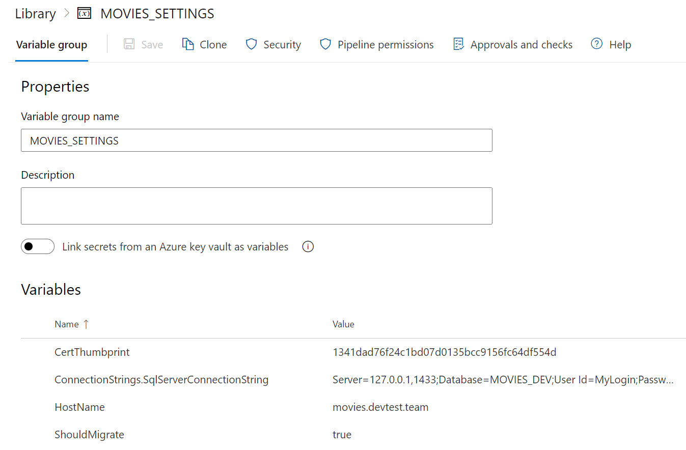

# Movies API

- How to setup SQL server and IIS deploy: https://trello.com/c/abEYNHOT
- Windows VM with Terraform: https://trello.com/c/lEv89VzJ

ASP NET Core WEB API with CQRS Architecture. Example of IIS Azure VM deploy example via Azure pipelines. Contains SSL
config for IIS using cert bot.

PS. I'd never think that will come back to this demo project from long past.

This is to test jenkins webhook.

## Kubernetes commands

- `kubectl apply -f .\mssql-pv.azure.yaml`
- `kubectl get deployments`
- `kubectl apply -f .\mssql-deployment.yaml`
- `kubectl delete -f .\mssql-deployment.yaml`
- `kubectl get services`
- `kubectl apply -f .\movies-configmap.yaml`
- `kubectl get pods -o wide`
- `kubectl get endpoints`

## DO NOT USE DATA CENTER 2022 WINDOWS IMAGE

- https://github.com/microsoft/azure-pipelines-extensions/issues/1008
- https://stackoverflow.com/a/61822201

## Required software

- [Hosting Bundle on Windows Server](https://dotnet.microsoft.com/en-us/download/dotnet/6.0)
- [CertBot for Windows](https://certbot.eff.org/instructions?ws=other&os=windows&tab=standard)
- OpenSSL (via choco)

## Docker commands

- `docker build -t "movies:latest" .`
- `docker run -d -p 9000:80 -e "ShouldMigrate=false" --name movies-test-run "movies:latest"`

## Azure DevOps Library Settings

## Notes

- [How to CertBot on Windows Server](https://medium.com/@nvbach91/how-to-create-lets-encrypt-s-free-wildcard-ssl-certificates-for-windows-server-iis-web-servers-aa01d939e0ad)
- [How to Create Login, User and Grant Permissions in SQL Server](https://www.guru99.com/sql-server-create-user.html)
- [Enable network protocols in SQL Server](https://stackoverflow.com/a/38641107)
- [Azure DevOps IISWebAppManagementOnMachineGroup@0 SSL 183 error](https://stackoverflow.com/a/61822201)
- [IIS Deployment using Azure pipelines YAML](https://medium.com/dvt-engineering/how-to-deploy-to-iis-using-azure-devops-yaml-pipelines-a5987f1b9b78)